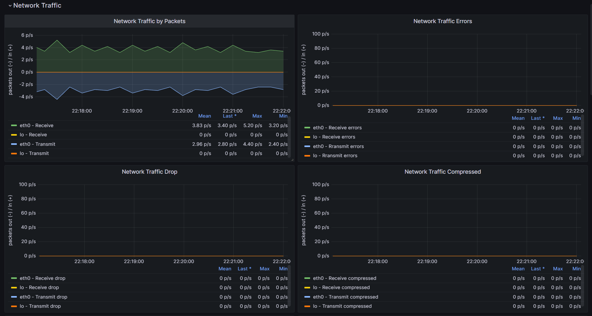

#  Дипломная работа по профессии «Системный администратор» - Неудахин Денис


Дипломная работа выполнена в сервисе Yandex Cloud.
Инфраструктура развёрнута с помощью Terraform и настроена с помощью Ansible.
Некоторые сервисы оказались недоступны, а именно Grafana, Kibana, Elasticsearch, Filebeat.
По этой причине я сначала загрузил эти релизы на свой хост, после чего использовав Ansible передал на соответствующин хосты.

## Работа сервисов
---------
Работа сайта происходит по ip http://51.250.73.15


Работа Kibana и сбор логов с Elasticsearch по адресу [Kibana](http://84.252.129.14:5601/app/discover#/?_g=(filters:!(),refreshInterval:(pause:!t,value:60000),time:(from:now-15m,to:now))&_a=(columns:!(),filters:!(),index:f3a1ebff-0a31-49f4-8e3d-29839432c5fd,interval:auto,query:(language:kuery,query:''),sort:!()))


Работа сервиса Grafana по адресу: [Grafana](http://158.160.62.196:3000/d/rYdddlPWk/node-exporter-full?orgId=1&refresh=5s&from=now-5m&to=now&var-DS_PROMETHEUS=default&var-job=node-exporter&var-node=192.168.10.22:9100&var-diskdevices=%5Ba-z%5D%2B%7Cnvme%5B0-9%5D%2Bn%5B0-9%5D%2B%7Cmmcblk%5B0-9%5D%2B), логин: "admin"; пароль: "Passw0rD"

Вывод http_response_count_total и http_response_size_bytes:


Вывод Utilization, Saturation, Errors для CPU, RAM, диски, сеть




## Инфраструктура
---------
Инфраструктура создаётся с помощью Terraform. Подробнее описана в файле /terraform/terraform.tf
Настройка инфраструктуры происходит с помощью Ansible.
В файле ansible.cfg раскомментирована строчка: 

```
inventory      = ./hosts
```

для того чтобы Ansible использовал файл inventory из директории где был запущен.
Файл /ansible/hosts.
В файле записаны все хосты и группы хостов и необходимые переменные для работы Ansible, а так же настройка ssh соединения позволяющая подключения ко всем хостам через bastion хост.
```
elst ansible_host=192.168.10.55
kbna ansible_host=10.0.0.66

prth ansible_host=192.168.10.77
grfn ansible_host=10.0.0.88

[bastion_server]
bastion ansible_host=158.160.59.188

[web]
web1 ansible_host=192.168.10.22
web2 ansible_host=192.168.20.33

[all:vars]
ansible_python_interpreter=/usr/bin/python3
ansible_user=user
ansible_ssh_common_args='-o ProxyCommand="ssh -W %h:%p -q user@158.160.59.188"'
```

В bastion ansible_host= записывается внешний IP бастион сервера из вывода работы Terraform.


# Сервера с сайтом.
---------
Создаються два сервера под размешение сайта.
Первый сервер расположен в зоне ru-central1-a, второй в зоне ru-central1-b. 
У обеих хостов отключен NAT, таким образом они не имеют внешнего IP адреса.

Раздел настройки веб серверов в файле /terraform/terraform.tf
```
# Первый веб сервер

resource "yandex_compute_instance" "vm-1" {
  name = "web-1"
  zone = "ru-central1-a"
  hostname = "web1"
  resources {
    cores  = 4
    memory = 4
  }

  boot_disk {
    initialize_params {
      image_id = "fd8o41nbel1uqngk0op2"
      size = 12
    }
  }

  network_interface {
    subnet_id = yandex_vpc_subnet.subnet-1.id
    ip_address = "192.168.10.22"
    security_group_ids = ["${yandex_vpc_security_group.webgroup.id}"]
  }

  metadata = {
    user-data = "${file("./meta.txt")}"
  }

}

# Второй веб сервер

resource "yandex_compute_instance" "vm-2" {
  name = "web2"
  zone = "ru-central1-b"
  hostname = "web2"
  resources {
    cores  = 4
    memory = 4
  }

  boot_disk {
    initialize_params {
      image_id = "fd8o41nbel1uqngk0op2"
      size = 12
    }
  }

  network_interface {
    subnet_id = yandex_vpc_subnet.subnet-2.id
    ip_address = "192.168.20.33"
    security_group_ids = ["${yandex_vpc_security_group.webgroup.id}"]
  }

  metadata = {
    user-data = "${file("./meta.txt")}"
  }
}
```

Настроены Security-group для работы сервисов на веб серверах.

Раздел настройки security-group веб серверов в файле /terraform/terraform.tf
```
## ГРУППЫ БЕЗОПАСНОСТИ WEB СЕРВЕРОВ ##

resource "yandex_vpc_security_group" "webgroup" {
  name        = "security-group-for-web"
  description = "description for web1 security group"
  network_id  = "${yandex_vpc_network.network-1.id}"

  ingress {
    protocol       = "TCP"
    description    = "balancer healthchekcs"
    v4_cidr_blocks = ["10.0.0.0/24"]
    port           = 30080
  }

  ingress {
    protocol       = "TCP"
    description    = "ext-http"
    v4_cidr_blocks = ["0.0.0.0/0"]
    port           = 80
  }

  ingress {
    protocol       = "TCP"
    description    = "ext-https"
    v4_cidr_blocks = ["0.0.0.0/0"]
    port           = 443
  }

  ingress {
    protocol       = "TCP"
    description    = "ssh"
    security_group_id = "${yandex_vpc_security_group.bastion.id}"
    port           = 22
  }

  ingress {
    protocol       = "TCP"
    description    = "prometheus"
    v4_cidr_blocks = ["192.168.10.0/24"]
    port           = 9090
  }

  ingress {
    protocol       = "TCP"
    description    = "prometheus-node"
    v4_cidr_blocks = ["192.168.10.0/24"]
    port           = 9100
  }

  ingress {
    protocol       = "TCP"
    description    = "prometheus-nginxlog"
    v4_cidr_blocks = ["192.168.10.0/24"]
    port           = 4040
  }

  ingress {
    protocol       = "TCP"
    description    = "elastic-filebeat"
    v4_cidr_blocks = ["192.168.10.0/24"]
    port           = 5044
  }

  ingress {
    protocol       = "TCP"
    description    = "elastic"
    v4_cidr_blocks = ["192.168.10.0/24"]
    port           = 9200
  }

  egress {
    protocol       = "ANY"
    description    = "any"
    v4_cidr_blocks = ["0.0.0.0/0"]
    from_port = 0
    to_port = 65535
  }
}
```

Плейбук /ansilbe/web-playbook.yml устанавливает и настраивает необходимые приложения.
Раздел установки и настройки nginx.
 - nginx
 - переносит template /ansible/template/index.html.j2 сайта
 - на сайт добавляет информацию об IP, CPU, RAM и имени хоста на сайт.
 - переносит конфигурационный файл nginx где изменяется формат логов для работы nginx-log-exporter:
 Файл ansible/template/nginx.conf представляет собой стандартные настройки nginx где в разеделе конфигурации логов изменён формат вывода под nginx-log-exporter.
 ```
         # logging config
        log_format custom   '$remote_addr - $remote_user [$time_local] '
                            '"$request" $status $body_bytes_sent '
                            '"$http_referer" "$http_user_agent" "$http_x_forwarded_for"';
 ```
 - перезапускает nginx
 - включает nginx в автозапуск
 
Файл /ansilbe/web-playbook.yml:
Секция установки и настройки nginx.
```
---
- name: Web-Playbook
  hosts: web
  tasks:
    - name: Instal nginx
      apt:
        name: nginx
        state: present
#### Сайт готово  ####
    - name: Apply index.html template
      template:
        src: ~/diploma/ansible/template/index.html.j2
        dest: /var/www/html/index.nginx-debian.html
    - name: add IP
      lineinfile:
        path: /var/www/html/index.nginx-debian.html
        insertafter: "^<h1>This PC's specs</h1>"
        line: '<h1>IP: "{{ ansible_facts.all_ipv4_addresses }}"</h1>'
    - name: add CPU
      lineinfile:
        path: /var/www/html/index.nginx-debian.html
        insertafter: "^<h1>This PC's specs</h1>"
        line: '<h1>CPU: "{{ ansible_processor }}"</h1>'
    - name: add RAM
      lineinfile:
        path: /var/www/html/index.nginx-debian.html
        insertafter: "^<h1>This PC's specs</h1>"
        line: '<h1>RAM: "{{ ansible_memory_mb.real }}"</h1>'
    - name: add Nodename
      lineinfile:
        path: /var/www/html/index.nginx-debian.html
        insertafter: "^<h1>This PC's specs</h1>"
        line: '<h1>Hostname: "{{ ansible_nodename }}"</h1>'

    - name: Apply nginx config
      template:
        src: ~/diploma/ansible/template/nginx.conf.j2
        dest: /etc/nginx/nginx.conf
    - name: Start nginx, if not started
      service:
        name: nginx
        state: restarted
    - name: Enable service nginx
      service:
        name: nginx
        enabled: yes

```

Раздел Filebeat:
- копирует файл filebeat-8.7.0-amd64.deb с моего хоста на веб сервера.
- устанавливает Filebeat
- переносит temlplate настроек filebeat.
Файл /ansible/template/filebeat.yml.j2
```
filebeat.inputs:
  - type: log
    enabled: true
    paths:
      - /var/log/nginx/access.log
      - /var/log/nginx/error.log
processors:
  - drop_fields:
      fields: ["beat", "input_type", "prospector", "input", "host", "agent", "ecs"]

output.elasticsearch:
  hosts: ["192.168.10.55:9200"]
```
- старует Filebeat
- включает автозагрузку Filebeat

Раздел Filebeat в /ansible/web-playbook.yml:
```
#### filebeat module #### Готово

    - name: Copy filebeat
      copy:
        src: ~/diploma/ansible/apps/filebeat-8.7.0-amd64.deb
        dest: ~/
    - name: install filebeat
      become: yes
      shell:
        cmd: dpkg -i ~/filebeat-8.7.0-amd64.deb
    - name: Apply filebeat config
      template:
        src: ~/diploma/ansible/template/filebeat.yml.j2
        dest: /etc/filebeat/filebeat.yml
    - name: Start filebeat
      service:
        name: filebeat
        state: restarted
    - name: Enable filebeat
      service:
        name: filebeat
        enabled: yes
```

Раздел Node Exporter:

- Загружает Node Exporter 
- Разахривирует Node Exporter
- Создаётся пользователь для Node Exporter: использован модуль shell.cmd так как модуль user выдаёт ошибки связанные с python.
- передаются права на папку и содержимое пользователю node_exporter
- переносится файл сервиса /ansible/template/node_exporter.service на хосты
- запускает node-exporter
- включает node-exporter в автозапуск

Раздел Node Exporter в /ansible/web-playbook.yml:
```
#### Node Exporter module #### Готово

    - name: Download node-exporter
      get_url:
        url: https://github.com/prometheus/node_exporter/releases/download/v1.5.0/node_exporter-1.5.0.linux-amd64.tar.gz
        dest: ~/
    - name: Unarchive node-exporter
      unarchive:
        src: ~/node_exporter-1.5.0.linux-amd64.tar.gz
        dest: /opt/
        remote_src: yes
    - name: Create user for node-exporter
      become: true
      shell:
        cmd: adduser --no-create-home --disabled-login --shell /bin/false --gecos "Node Exporter User" node_exporter
    - name: Change righs for node-exporter folder
      file:
        path: /opt/node_exporter-1.5.0.linux-amd64
        state: directory
        recurse: yes
        owner: node_exporter
        group: node_exporter
    - name: Create node-exporter service
      become: yes
      copy:
        src: ~/diploma/ansible/template/node_exporter.service
        dest: /etc/systemd/system
    - name: Start node-exporter
      service:
        name: node_exporter
        state: restarted
    - name: Enable node-exporter
      service:
        name: node_exporter
        enabled: yes
```

Раздел Nginx log exporter:
- модулем apt.deb устанавливает nginx-log-exporter сразу с репозитория github
- копируется файл сервиса /ansible/template/nginxlog_exporter.service на хосты
- стартуер Nginx log exporter
- включает в автозагрузку Nginx log exporter

Раздел Nginx log exporter в /ansible/web-playbook.yml:
```
#### Nginx log exporter ####
    - name: Install nginx-log-exporter
      apt:
        deb: https://github.com/martin-helmich/prometheus-nginxlog-exporter/releases/download/v1.9.2/prometheus-nginxlog-exporter_1.9.2_linux_amd64.deb
    - name: Create node-exporter service
      become: yes
      copy:
        src: ~/diploma/ansible/template/nginxlog_exporter.service
        dest: /etc/systemd/system/
    - name: Apply Nginx-log-exporter config
      copy:
        src: ~/diploma/ansible/template/prometheus-nginxlog-exporter.yml
        dest: /etc/prometheus-nginxlog-exporter.yml
    - name: Start nginx-log-exporter
      service:
        name: nginxlog_exporter.service
        state: restarted
    - name: Enable nginx-log-exporter
      service:
        name: nginxlog_exporter.service
        enabled: yes
```
Конец файла /ansible/web-playbook.yml.


# Bastion-host.
---------
Настройки Bastion-host в файле /terraform/terraform.tf
```
# Сервер Batsion host

resource "yandex_compute_instance" "vm-3" {
  name = "bastion"
  zone = "ru-central1-a"
  hostname = "bastion"
  resources {
    cores  = 2
    memory = 2
  }

  boot_disk {
    initialize_params {
      image_id = "fd8o41nbel1uqngk0op2"
      size = 12
    }
  }

  network_interface {
    subnet_id = yandex_vpc_subnet.subnet-3.id
    ip_address = "10.0.0.44"
    nat       = true
    security_group_ids = ["${yandex_vpc_security_group.bastion.id}"]
  }

  metadata = {
    user-data = "${file("./meta.txt")}"
  }
}
```

Настройки в разделе Security-group для Bastion-host в файле /terraform/terraform.tf

```
## ГРУППА БЕЗОПАСНОСТИ BASTION=HOST ##

resource "yandex_vpc_security_group" "bastion" {
  name        = "bastion-security-group"
  description = "bastion security group"
  network_id  = "${yandex_vpc_network.network-1.id}"

  ingress {
    protocol       = "ICMP"
    description    = "ssh rule"
    v4_cidr_blocks = ["0.0.0.0/0"]
    from_port = 0
    to_port = 65535
  }

  ingress {
    protocol       = "ANY"
    description    = "ssh rule"
    v4_cidr_blocks = ["0.0.0.0/0"]
    port           = 22
  }

  egress {
    protocol       = "ANY"
    description    = "ssh rule"
    v4_cidr_blocks = ["10.0.0.0/24", "192.168.20.0/24", "192.168.10.0/24"]
    port           = 22
  }
}
```

# Сервер Elasticsearch.
---------

Настройки VM под Elasticsearch в файле /terraform/terraform.tf
```
# Сервер Elasticsearch

resource "yandex_compute_instance" "vm-4" {
  name = "elastic"
  zone = "ru-central1-a"
  hostname = "elst"
  resources {
    cores  = 4
    memory = 4
  }

  boot_disk {
    initialize_params {
      image_id = "fd8o41nbel1uqngk0op2"
      size = 12
    }
  }

  network_interface {
    subnet_id = yandex_vpc_subnet.subnet-1.id
    ip_address = "192.168.10.55"
    security_group_ids = ["${yandex_vpc_security_group.elastic.id}"]
  }

  metadata = {
    user-data = "${file("./meta.txt")}"
  }
}
```

Настройки в разделе Security-group для Elasticsearch в файле /terraform/terraform.tf

```
## ГРУППА БЕЗОПАСНОСТИ ELASTICSEARCH ##

resource "yandex_vpc_security_group" "elastic" {
  name        = "security-group-for-elastic"
  description = "description for elastic security group"
  network_id  = "${yandex_vpc_network.network-1.id}"

  ingress {
    protocol       = "TCP"
    description    = "ssh"
    security_group_id = "${yandex_vpc_security_group.bastion.id}"
    port           = 22
  }

  ingress {
    protocol       = "TCP"
    description    = "elastic-filebeat"
    v4_cidr_blocks = ["192.168.10.0/24", "192.168.20.0/24"]
    port           = 5044
  }

  ingress {
    protocol       = "TCP"
    description    = "elastic"
    v4_cidr_blocks = ["192.168.10.0/24", "10.0.0.0/24"]
    port           = 9200
  }

  egress {
    protocol       = "ANY"
    description    = "any"
    v4_cidr_blocks = ["0.0.0.0/0"]
    from_port = 0
    to_port = 65535
  }
}
```

Настройка и установка приложений для хоста с Elasticsearch происходит в файле /ansible/elst-playbook.yml в плейбуке elastic-playbook.
Раздел elastic-playbook:
- Elasticsearch копируется с моего хоста на удалённый хост.
- устанавливает Elasticsearch
- перекидывание файла настроек /ansible/template/elasticsearch.yml.j2
Основные настройки остались стандартными кроме:
```
network.host: 192.168.10.55
http.port: 9200
xpack.security.http.ssl:
  enabled: false
  keystore.path: certs/http.p12
xpack.security.transport.ssl:
  enabled: false
  verification_mode: certificate
  keystore.path: certs/transport.p12
  truststore.path: certs/transport.p12
http.host: 0.0.0.0
```
- стартует Elasticsearch
- включает автозагрузку

Раздел Elasticsearch в /ansible/elst-playbook.yml
```
---
- name: elastic-playbook
  hosts: elst
  tasks:
    - name: Copy Elasticsearch
      copy:
        src: ~/diploma/ansible/apps/elasticsearch-8.7.0-amd64.deb
        dest: ~/
    - name: Install elasticsearch
      become: yes
      shell:
        cmd: dpkg -i ~/elasticsearch-8.7.0-amd64.deb
    - name: Apply elasticsearch config
      template:
        src: ~/diploma/ansible/template/elasticsearch.yml.j2
        dest: /etc/elasticsearch/elasticsearch.yml
    - name: Start Elasticsearch
      service:
        name: elasticsearch
        state: restarted
    - name: Enable elasticsearch
      service:
        name: elasticsearch
        enabled: yes
```

# Сервер Kibana.
---------

Настройки VM под Kibana в файле /terraform/terraform.tf
```
# Сервер Kibana

resource "yandex_compute_instance" "vm-5" {
  name = "kibana"
  zone = "ru-central1-a"
  hostname = "kbna"
  resources {
    cores  = 2
    memory = 2
  }

  boot_disk {
    initialize_params {
      image_id = "fd8o41nbel1uqngk0op2"
      size = 12
    }
  }

  network_interface {
    subnet_id = yandex_vpc_subnet.subnet-3.id
    ip_address = "10.0.0.66"
    nat       = true
    security_group_ids = ["${yandex_vpc_security_group.kibana.id}"]
  }

  metadata = {
    user-data = "${file("./meta.txt")}"
  }
}
```

Настройки в разделе Security-group для Kibana в файле /terraform/terraform.tf
```
## ГРУППА БЕЗОПАСНОСТИ KIBANA ##

resource "yandex_vpc_security_group" "kibana" {
  name        = "security-group-for-kibana"
  description = "description for kibana security group"
  network_id  = "${yandex_vpc_network.network-1.id}"

  ingress {
    protocol       = "TCP"
    description    = "ssh"
    security_group_id = "${yandex_vpc_security_group.bastion.id}"
    port           = 22
  }

  ingress {
    protocol       = "TCP"
    description    = "elastic"
    v4_cidr_blocks = ["192.168.10.0/24"]
    port           = 9200
  }

  ingress {
    protocol       = "TCP"
    description    = "kibana"
    v4_cidr_blocks = ["0.0.0.0/0"]
    port           = 5601
  }

  egress {
    protocol       = "ANY"
    description    = "any"
    v4_cidr_blocks = ["0.0.0.0/0"]
    from_port = 0
    to_port = 65535
  }
}
```

Настройка и установка приложений для хоста с Kibana происходит в файле /ansible/elst-playbook.yml в плейбуке Kibana-playbook.
Раздел Kibana-playbook:
- Kibana копируется с моего хоста на удалённый хост.
- устанавливает Kibana
- перекидывание файла настроек /ansible/template/kibana.yml.j2
Основные настройки остались стандартными кроме:
```
server.port: 5601
server.host: "0.0.0.0"
elasticsearch.hosts: ["http://192.168.10.55:9200"]
```
- стартует Kibana
- включает автозагрузку Kibana

Раздел Kibana в /ansible/elst-playbook.yml
```
# Второй плейбук по установке и настройки кибаны
- name: Kibana-playbook
  hosts: kbna
  tasks:
    - name: Copy Kibana
      copy:
        src: ~/diploma/ansible/apps/kibana-8.7.0-amd64.deb
        dest: ~/
    - name: Instal Kibana
      become: yes
      shell:
        cmd: dpkg -i ~/kibana-8.7.0-amd64.deb
    - name: Apply kibana config
      template:
        src: ~/diploma/ansible/template/kibana.yml.j2
        dest: /etc/kibana/kibana.yml
    - name: Start Kibana
      service:
        name: kibana
        state: restarted
    - name: Enable kibana
      service:
        name: kibana
        enabled: yes
```
Конец файла /ansible/elst-playbook.yml.

# Сервер Prometheus.
---------

Настройки VM под Prometheus в файле /terraform/terraform.tf
```
# Сервер Prometheus

resource "yandex_compute_instance" "vm-6" {
  name = "prometheus"
  zone = "ru-central1-a"
  hostname = "prth"
  resources {
    cores  = 4
    memory = 4
  }

  boot_disk {
    initialize_params {
      image_id = "fd8o41nbel1uqngk0op2"
      size = 20
    }
  }

  network_interface {
    subnet_id = yandex_vpc_subnet.subnet-1.id
    ip_address = "192.168.10.77"
    security_group_ids = ["${yandex_vpc_security_group.prometheus.id}"]
  }

  metadata = {
    user-data = "${file("./meta.txt")}"
  }
}
```

Настройки в разделе Security-group для Prometheus в файле /terraform/terraform.tf
Порт 80 и 443 нужен для загрузки релиза prometheus.
```
## ГРУППА БЕЗОПАСНОСТИ PROMETHEUS ##

resource "yandex_vpc_security_group" "prometheus" {
  name        = "security-group-for-prometheus"
  description = "prometheus security group"
  network_id  = "${yandex_vpc_network.network-1.id}"

  ingress {
    protocol       = "TCP"
    description    = "ext-http"
    v4_cidr_blocks = ["0.0.0.0/0"]
    port           = 80
  }

  ingress {
    protocol       = "TCP"
    description    = "ext-https"
    v4_cidr_blocks = ["0.0.0.0/0"]
    port           = 443
  }

  ingress {
    protocol       = "TCP"
    description    = "ssh"
    security_group_id = "${yandex_vpc_security_group.bastion.id}"
    port           = 22
  }

  ingress {
    protocol       = "TCP"
    description    = "prometheus-node"
    v4_cidr_blocks = ["192.168.10.0/24", "192.168.20.0/24"]
    port           = 3000
  }

  ingress {
    protocol       = "TCP"
    description    = "prometheus-node"
    v4_cidr_blocks = ["192.168.10.0/24", "192.168.20.0/24", "10.0.0.0/24"]
    port           = 9090
  }

  egress {
    protocol       = "ANY"
    description    = "any"
    v4_cidr_blocks = ["0.0.0.0/0"]
    from_port = 0
    to_port = 65535
  }
}
```

Настройка и установка приложений для хоста с Prometheus происходит в файле /ansible/prth-playbook.yml в плейбуке prometheus-playbook.
Раздел prometheus-playbook:
- создаёт пользователя для prometheus модулем shell.cmd так как модуль user выдаёт ошибки связанные с python.
- загружает официальный релиз с github
- разахривирует prometheus 
- запускает скрипт /ansible/scripts/moveprometheus.sh который переносит директории с файлами в нужные каталоги и передаёт владение над ними пользователю prometheus
```
cd ~/prometheus-2.43.0.linux-amd64
mkdir /etc/prometheus
mkdir /var/lib/prometheus
cp ./prometheus promtool /usr/local/bin/
cp -R ./console_libraries /etc/prometheus
cp -R ./consoles /etc/prometheus
cp ./prometheus.yml /etc/prometheus

chown -R prometheus:prometheus /etc/prometheus /var/lib/prometheus
chown prometheus:prometheus /usr/local/bin/prometheus
chown prometheus:prometheus /usr/local/bin/promtool
```
- переносит файл сервиса для prometheus /ansible/template/prometheus.service
- переносит файл конфигурацию prometheus /ansible/template/prometheus.yml.j2
Файл /ansible/template/prometheus.yml.j2:
```
global:
  scrape_interval: 15s

scrape_configs:
#  - job_name: 'prometheus'
#    scrape_interval: 5s
#    static_configs:
#      - targets: ['localhost:9090']

  - job_name: 'node-exporter'
    scrape_interval: 5s
    static_configs:
      - targets: ['192.168.10.22:9100']
      - targets: ['192.168.20.33:9100']
  - job_name: 'nginx-log-exporter'
    scrape_interval: 5s
    static_configs:
      - targets: ['192.168.10.22:4040']
      - targets: ['192.168.20.33:4040']
```
- стартует prometheus
- добавляет в автозагрузку 

Раздел prometheus-playbook в файле /ansible/prth-playbook.yml
```
---
- name: prometheus-playbook
  hosts: prth
  become: true
  tasks:
    - name: Create prometheus user
      shell:
        cmd: useradd --no-create-home --shell /bin/false prometheus
    - name: Download prometheus
      get_url:
        url: https://github.com/prometheus/prometheus/releases/download/v2.43.0/prometheus-2.43.0.linux-amd64.tar.gz
        dest: ~/
    - name: Unarchive prometheus
      unarchive:
        src: ~/prometheus-2.43.0.linux-amd64.tar.gz
        dest: ~/
        remote_src: yes
    - name: Execute scripts that moves prometheus and gives permisions
      become: yes
      script: ~/diploma/ansible/scripts/moveprometheus.sh
    - name: creating service for prometheus
      become: yes
      copy:
        src: ~/diploma/ansible/template/prometheus.service
        dest: /etc/systemd/system
    - name: Apply prometheus config
      template:
        src: ~/diploma/ansible/template/prometheus.yml.j2
        dest: /etc/prometheus/prometheus.yml
    - name: Start Prometheus
      service:
        name: prometheus
        state: restarted
    - name: Enable Prometheus
      service:
        name: prometheus
        enabled: yes
```

# Сервер Grafana.
---------

Dashboard Grafana расположен в /ansbile/template/grafana.json

Настройки VM под Grafana в файле /terraform/terraform.tf
```
# Сервер Grafana

resource "yandex_compute_instance" "vm-7" {
  name = "grafana"
  zone = "ru-central1-a"
  hostname = "grfn"
  resources {
    cores  = 2
    memory = 2
  }

  boot_disk {
    initialize_params {
      image_id = "fd8o41nbel1uqngk0op2"
      size = 12
    }
  }

  network_interface {
    subnet_id = yandex_vpc_subnet.subnet-3.id
    ip_address = "10.0.0.88"
    nat       = true
    security_group_ids = ["${yandex_vpc_security_group.grafana.id}"]
  }

  metadata = {
    user-data = "${file("./meta.txt")}"
  }
}
```

Настройки в разделе Security-group для Grafana в файле /terraform/terraform.tf
```
## ГРУППА БЕЗОПАСНОСТИ GRAFANA ##

resource "yandex_vpc_security_group" "grafana" {
  name        = "security-group-for-grafana"
  description = "description for grafana security group"
  network_id  = "${yandex_vpc_network.network-1.id}"

  ingress {
    protocol       = "TCP"
    description    = "ext-http"
    v4_cidr_blocks = ["0.0.0.0/0"]
    port           = 80
  }

  ingress {
    protocol       = "TCP"
    description    = "ext-https"
    v4_cidr_blocks = ["0.0.0.0/0"]
    port           = 443
  }

  ingress {
    protocol       = "TCP"
    description    = "ssh"
    security_group_id = "${yandex_vpc_security_group.bastion.id}"
    port           = 22
  }

  ingress {
    protocol       = "TCP"
    description    = "prometheus-node"
    v4_cidr_blocks = ["0.0.0.0/0"]
    port           = 3000
  }

  ingress {
    protocol       = "TCP"
    description    = "prometheus-node"
    v4_cidr_blocks = ["192.168.10.0/24"]
    port           = 9090
  }

  egress {
    protocol       = "ANY"
    description    = "any"
    v4_cidr_blocks = ["0.0.0.0/0"]
    from_port = 0
    to_port = 65535
  }
}
```

Настройка и установка приложений для хоста с Grafana происходит в файле /ansible/prth-playbook.yml в плейбуке grafana-playbook.
Раздел grafana-playbook:
- устанавливает необходимый пакет для grafana: libfontconfig1
- релиз grafana копируется с моего хоста на удалённый хост
- устанавливается grafana
- стартуется grafana
- добавляется автозагрузку

Раздел grafana-playbook в файле /ansible/prth-playbook.yml
```
#### Второй плейбук по установке Grafana ####
- name: grafana-playbook
  hosts: grfn
  tasks:
    - name: install libfontconfig1
      apt:
        name: libfontconfig1
        state: present
        update_cache: yes
    - name: Download grafana
      copy:
        src: ~/diploma/ansible/apps/grafana-enterprise_9.4.7_amd64.deb
        dest: ~/
    - name: Install grafana
      apt:
        deb: ~/grafana-enterprise_9.4.7_amd64.deb
    - name: Start grafana
      service:
        name: grafana-server
        state: restarted
    - name: Enable Grafana
      service:
        name: grafana-server
        enabled: yes
```
Конец файла /ansible/prth-playbook.yml.


# Настройки сети.
---------
Настройки сети в файле /terraform/terraform.tf

```
######                         NETWORK                          ######

# Создание VPC

resource "yandex_vpc_network" "network-1" {
  name = "nework1"
  description = "Main VPC"
}

# Создание подсетей

resource "yandex_vpc_subnet" "subnet-1" {
  name           = "subnet1"
  description    = "Private network fow web1"
  zone           = "ru-central1-a"
  network_id     = "${yandex_vpc_network.network-1.id}"
  v4_cidr_blocks = ["192.168.10.0/24"]
  route_table_id = yandex_vpc_route_table.rt.id
}

resource "yandex_vpc_subnet" "subnet-2" {
  name           = "subnet2"
  description    = "Private network fow web2"
  zone           = "ru-central1-b"
  network_id     = "${yandex_vpc_network.network-1.id}"
  v4_cidr_blocks = ["192.168.20.0/24"]
  route_table_id = yandex_vpc_route_table.rt.id
}

resource "yandex_vpc_subnet" "subnet-3" {
  name           = "subnet3"
  description    = "Public network"
  zone           = "ru-central1-a"
  network_id     = "${yandex_vpc_network.network-1.id}"
  v4_cidr_blocks = ["10.0.0.0/24"]
}
```

Настройки шлюза для Веб и Prometheus серверов /terraform/terraform.tf позволяющие им выходить в интернет не имея публичного адреса.
```
# Шлюз для веб серверов


resource "yandex_vpc_gateway" "nat_gateway" {
  name = "web-gateway"
  shared_egress_gateway {}
}

resource "yandex_vpc_route_table" "rt" {
  name       = "web-route-table"
  network_id = "${yandex_vpc_network.network-1.id}"

  static_route {
    destination_prefix = "0.0.0.0/0"
    gateway_id         = yandex_vpc_gateway.nat_gateway.id
  }
}
```

Настройки балансировщика для сайта в файле /terraform/terraform.tf
```
# Целевая группа ##################################################################

resource "yandex_alb_target_group" "target-1" {
  name           = "target-grpup"

  target {
    subnet_id    = "${yandex_vpc_subnet.subnet-1.id}"
    ip_address   = "${yandex_compute_instance.vm-1.network_interface.0.ip_address}"
  }

  target {
    subnet_id    = "${yandex_vpc_subnet.subnet-2.id}"
    ip_address   = "${yandex_compute_instance.vm-2.network_interface.0.ip_address}"
  }
}

# Бэкэнд


resource "yandex_alb_backend_group" "main-backend-group" {
  name                     = "main-back-end-group"

  http_backend {
    name                   = "http-backend"
    weight                 = 1
    port                   = 80
    target_group_ids       = ["${yandex_alb_target_group.target-1.id}"]
    load_balancing_config {
      panic_threshold      = 90
    }
    healthcheck {
      timeout              = "10s"
      interval             = "2s"
      healthy_threshold    = 10
      unhealthy_threshold  = 15
      http_healthcheck {
        path               = "/"
      }
    }
  }
}


# HTTP Роутер


resource "yandex_alb_http_router" "http-router" {
  name   = "web-http-router"
}

resource "yandex_alb_virtual_host" "virtual-host" {
  name           = "virtual-host-for-router"
  http_router_id = yandex_alb_http_router.http-router.id
  route {
    name = "http-route"
    http_route {
      http_match {
      }
      http_route_action {
        backend_group_id = "${yandex_alb_backend_group.main-backend-group.id}"
        timeout          = "3s"
      }
    }
  }
}


# Балансировщик

resource "yandex_alb_load_balancer" "http-balancer" {
  name        = "http-balancer"
  network_id  = "${yandex_vpc_network.network-1.id}"

  allocation_policy {
    location {
      zone_id   = "ru-central1-a"
      subnet_id = "${yandex_vpc_subnet.subnet-3.id}"
    }
  }

  listener {
    name = "my-listener"
    endpoint {
      address {
        external_ipv4_address {
        }
      }
      ports = [ 80 ]
    }
    http {
      handler {
        http_router_id = "${yandex_alb_http_router.http-router.id}"
      }
    }
  }
}
```

# Создания Snapshot'ов дисков.
---------

В консоли управления интерфейса yandex-cloud.


Настройки snapshot'ов в файле /terraform/terraform.tf
```
#### Disk Snapshot ####

resource "yandex_compute_snapshot_schedule" "default" {
  name           = "disk-snapshot"

  schedule_policy {
    expression = "0 0 ? * *"
  }
  retention_period = "168h"
#  snapshot_count = 1

  snapshot_spec {
      description = "snapshot-description"
      labels = {
        snapshot-label = "disk-snapshot"
      }
  }

  labels = {
    my-label = "my-label-value"
  }

  disk_ids = ["${yandex_compute_instance.vm-1.boot_disk.0.disk_id}", "${yandex_compute_instance.vm-2.boot_disk.0.disk_id}", "${yandex_compute_instance.vm-3.boot_disk.0.disk_id}", "${yandex_compute_instance.vm-4.boot_disk.0.disk_id}", "${yandex_compute_instance.vm-5.boot_disk.0.disk_id}", "${yandex_compute_instance.vm-6.boot_disk.0.disk_id}", "${yandex_compute_instance.vm-7.boot_disk.0.disk_id}"]
}
```

# Вывод IP адрессов VM в консоли.
---------


```
# Вывод IP адресов веб серверов

output "internal_ip_address_vm_1" {
  value = yandex_compute_instance.vm-1.network_interface.0.ip_address
}
output "external_ip_address_vm_1" {
  value = yandex_compute_instance.vm-1.network_interface.0.nat_ip_address
}

output "internal_ip_address_vm_2" {
  value = yandex_compute_instance.vm-2.network_interface.0.ip_address
}
output "external_ip_address_vm_2" {
  value = yandex_compute_instance.vm-2.network_interface.0.nat_ip_address
}

# Вывод ip сервера bastion_host

output "internal_ip_address_vm_3" {
  value = yandex_compute_instance.vm-3.network_interface.0.ip_address
}

output "external_ip_address_vm_3" {
  value = yandex_compute_instance.vm-3.network_interface.0.nat_ip_address
}

# Вывод ip серверов Elastic и Kibana


output "internal_ip_address_vm_4" {
  value = yandex_compute_instance.vm-4.network_interface.0.ip_address
}

output "external_ip_address_vm_4" {
  value = yandex_compute_instance.vm-4.network_interface.0.nat_ip_address
}

output "internal_ip_address_vm_5" {
  value = yandex_compute_instance.vm-5.network_interface.0.ip_address
}

output "external_ip_address_vm_5" {
  value = yandex_compute_instance.vm-5.network_interface.0.nat_ip_address
}


# Вывод Ip prometheus и Grafana

output "internal_ip_address_vm_6" {
  value = yandex_compute_instance.vm-6.network_interface.0.ip_address
}

output "external_ip_address_vm_6" {
  value = yandex_compute_instance.vm-6.network_interface.0.nat_ip_address
}

output "internal_ip_address_vm_7" {
  value = yandex_compute_instance.vm-7.network_interface.0.ip_address
}

output "external_ip_address_vm_7" {
  value = yandex_compute_instance.vm-7.network_interface.0.nat_ip_address
}


# Вывод Ip балансера

output "external_ip_address_http_balancer" {
  value = yandex_alb_load_balancer.http-balancer.listener.0.endpoint.0.address.0.external_ipv4_address.0.address
}
```
